# Get Started with Performance Profiling (Preview)
## Configuring and running profiling
  * To start profiling select in the menu `Tools > Tizen > Profiler > Run profiler`.

    

  * _Profiler Setting_ window will be opened.
   
    

    * **Path to application** will be set up automatically in accordance with the opened Solution.
    * **Arguments** - user defined arguments which will be passed to the application **TODO**.
    * **Profiling preset** – predefined sets of options for different profiling aspects (CPU, Memory Allocation, Source Lines). The less options are included - the less overhead and less data are collected and processed.

        | Profiling preset | CPU | Memory Allocation | Source Lines |
        | --- | :---: | :---: | :---: |
        | CPU Sampling | + | - | + |
        | Memory Allocation | - | + | + |
        | Complex Profiling | + | + | + |

    * **Options**

        | Option | Description | CPU Sampling | Memory Allocation | Complex Profiling |
        | --- | --- | :---: | :---: | :---: |
        | **Sampling Options** |
        | Sampling Interval | Time interval between samples in miliseconds | 10 | 10 | 10 |
        | High Granularity | Enable high accuracy and saturated samples. If option is disabled, samples will be dumped only on allocation and stack changing events | on | on | on |
        | **Trace Options** |
        | Trace Execution | Enable tracking of information about execution stack changes | on | off | on |
        | Trace Memory | Enable tracking of information about allocations | off | on | on |
        | Trace Garbage Collection | Enable tracking of information about Garbage Collector events | - | on | on |
        | Trace Source Lines | Enable tracking of instruction pointers for samples. Profiler generates information about IL to native code mapping that can be used for matching between IP and source code fragments | on | on | on |
        | Stack Track | Enable tracking of execution stack state for memory allocations | - | off | on |
        | **CPU Tracing Options** |
        | Enable CPU | Enable tracking of CPU usage by process and/or managed threads | on | on | on |
        | Trace Process | Enable tracking of CPU usage by application process | on | on | on |
        | Trace Threads | Enable tracking of CPU usage by application managed threads | on | on | on |
        | Trace Interval | Timeout between CPU usage measurements in milliseconds | 10 | 10 | 10 |
        | **Misc Options** |
        | Delayed start | Delay start of profiling. To start profiling it is need to click _Start_ button in the _Profiling Progress_ window | off | off | off |

    * Click _Ok_ button.
    * _Output_ window (highlighted with orange rectanlge, also be sure that window shows output from Tizen (green highlight)) and _Profiling Progress_ window (red highlight) will be being shown during profiling.

      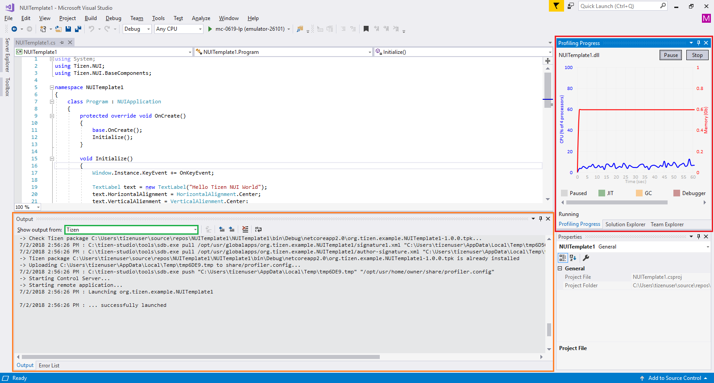

    * To stop profiling click _Stop_ button in the _Profiling Progress_ window. _Output_ window will display information about stopping profiling process.
   
      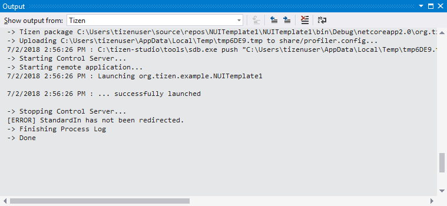

    * In the result session entity will be generated which can be opened and managed via _Session Explorer_ window.

## Live profiling
  _Live Profiling_ allows to profile an application during debugging.

  * To enable _Live Profiling_ the next actions are need:
      * To open _Tizen_ options select in the menu `Tools > Options > Tizen > Tools`.
      * Turn on option `Use new debugger when available`.
      * Turn on option `Use Live Profiler on debugging`.

    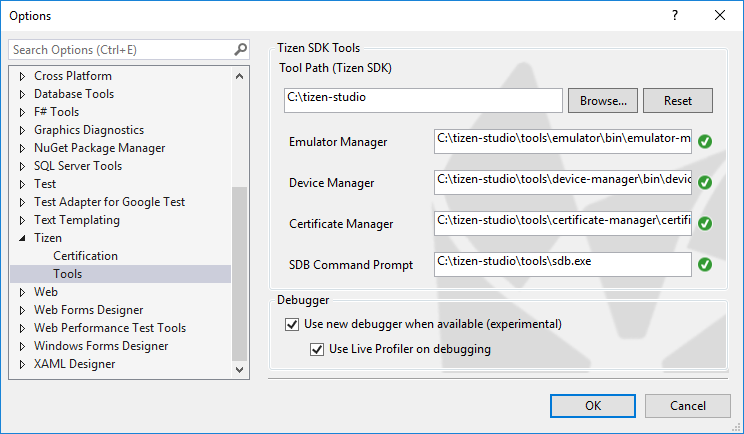

## _Profiling Progress_ window
  The window shows CPU Utilization and Memory consumption by application in the real-time mode.

  

  * On the top right corner buttons _Pause/Resume_ and _Stop_ are located. But if the profiling was started in the _Delayed_ mode instead _Pause/Resume_ button _Start_ button will be to start profiling.

  * Depends on the profiling options it is possibly to track JIT and GC events in the real-time mode.

    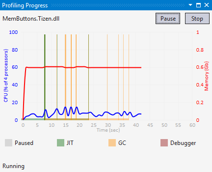

  * In the debug mode the window shows debugger events, e.g.: when an application was paused by breakpoint or debug pause button.

    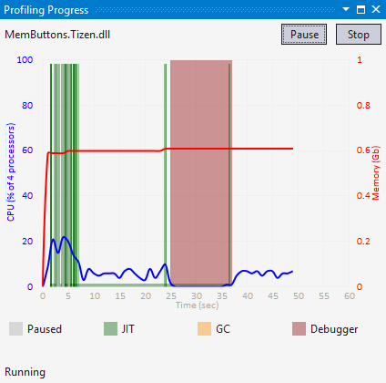
  
  * To pause profiling click _Pause_ button.

  * To resume profiling click _Resume_ button.

  * To stop profiling click _Stop_ button.

  * On the left bottom corner current status is displayed.

## Managing session
  * To open _Session Explorer_ window select in the menu `Tools > Tizen > Profiler > Session Explorer`.
   
     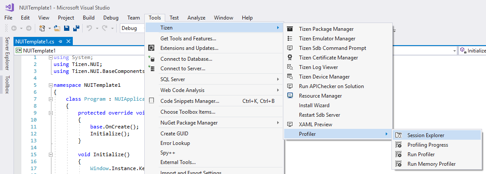

  * _Session Explorer_ window contains a list of profiling sessions which have been collected within opened Solution. A list entry which is mapped to the session has the next describing fields:
    * Date - date and time of profiling session.
    * Preset - name of the used Profiling preset to create profiling session.
    * Device - name of the used device for profiling.
    * Project - name of the profilled project.
    * Annotation (optional) - user defined Session annotation.
      
      

  * Additional session’s information is displayed in _Properties_ window (usually it is placed below _Session Explorer_ window). The window contains information about specific session's parameters that had been used to configure the profiler for that session. Annotation field can be edited in this window.
    
      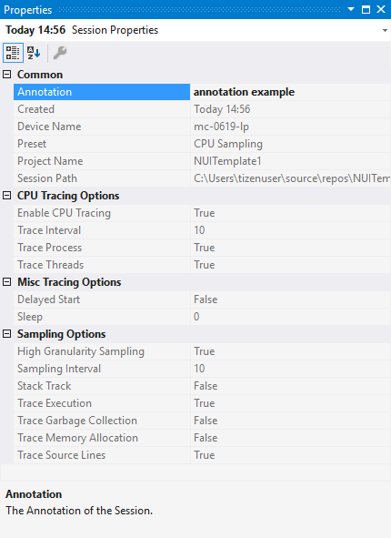

  * To open session double click on the session's entry.
  * To manage session click `Right Mouse Button` on the session's entry.
      
    

    The next possible operations with session entry are available:
    * Open Profile Session
    * Open Memory Profile Session (availability depends on the session's parameters)
    * Edit Annotation
    * Delete

## Analyzing session data
  Depends on the chosen Profiling preset there are available two types of the session data's viewers:
  * Profile Session viewer - if _CPU Samplings_ or _Complex_ preset had been chosen.
  * Memory Profile Session viewer - if _Memory Allocation_ or _Complex_ preset had been chosen.

  If _Complex_ preset have been chosen both types of sessions will be available.

### Profile Session viewer

  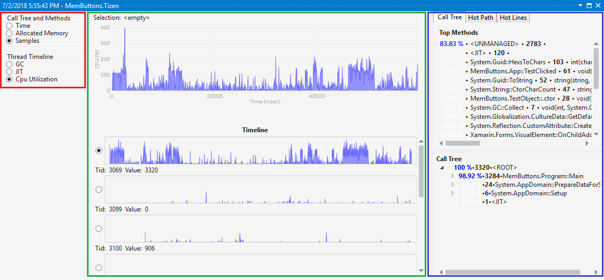

  The window wll be automatically shown during profiling or live profiling.

  To open it manually select in the menu `Tools > Tizen > Profiler > Profiling Progress`.

  The viewer has the next panels:

  * **Filters (red highlight)** - consists of the next types of filters:
    * Call Tree and methods
      * Time
      * Allocated Memory
      * Samples

      Depends on the selected filter _Timeline_ and _Methods_ panels will be filtered.

    * Thread Timeline
      * GC (Garbage Collection)
      * JIT (Just In Time Compilation)
      * Cpu Utilization
    
      Depends on the selected filter charts in the _Timeline_ panel will display appropriate information.

  * **Timeline (green highlight)** - includes the next timeline charts:
    * CPU utilization of the application in the top of the panel.
    
      * Top left corner displays current **_Time interval_**. By default the application's lifespan is got as _Time interval_ and in this case top left corner displays: `Selection: <empty>`; in other case current _Time interval_ is shown, e.g.: `Selection: 21556 : 35899`.
      
        **All panels except _Filters_ depend on the current _Time interval_.**

        It is possibly to set _Time interval_ via mouse: click and drag `Left Mouse Button` to set new _Time interval_.

        

      * The chart can handle `Right Mouse Button`.

        

        Timeline Context Menu has next entries:
        * Zoom to Selection
        * Reset Zoom
        * Reveal Selection

      * To reset _Time interval_ click outside selected area.

      * To set zoom in/out the combination `ctrl + Whell Up/Down Mouse Button` should bu used.

    * GC, JIT or CPU Utilization for separate threads in the rest part of the panel.
      
      Depends on the current _Call Tree and methods_ filter field _Value_ on the left below chart shows appropriate inforamtion: Time (e.g.: `Value: 00.59.920`), Allocated Memory (e.g.: `Value: 56.36 MB`) or Samples (e.g.: `Value: 3320`).

      Depends on the current _Thread Timeline_ filter charts shows appropriate information.

      * GC

        

      * JIT

        

      * CPU Utilization

        

      **_Methods_ panel depends on the selected thread.**

  * **Methods (blue highlight)**

    Panel consists of 3 tabs:
    * Top Methods and Call Tree - displays top methods and call tree by the selected _Call Tree and methods_ filter on the selected _Time interval_ for the selected thread.

      Each entry includes the next fields splitted by `•` symbol:
      * Percentage ratio - method's percentage ratio based on the selected _Call Tree and methods_ filter between total value and method's value.
      * Name of a method.
      * Absolute value - depends on the selected _Call Tree and methods_ filter shows the next information:
        * Time - shows how much time method has occupied.
        * Allocated Memory - shows an amount of memory allocations within method (in `Kb` or `Mb`).
        * Samples - shows amount of samples within method.
      * Signature of a method (optional).

    * Hot Path - displays hot path by the selected _Call Tree and methods_ filter on the selected _Time interval_ for the selected thread. In the collapsed state the _Hot Path_ tab displays the hottest method. In the  expanded state the _Hot Path_ tab displays the whole path from this method to the root method.
         
      

      Each entry includes the next fields splitted by `•` symbol:
      * Percentage ratio - method's percentage ratio based on the selected _Call Tree and methods_ filter between total value and method's value.
      * Name of a method.
      * Absolute value - depends on the selected _Call Tree and methods_ filter shows the next information:
        * Time - shows how much time method has occupied.
        * Allocated Memory - shows an amount of memory allocations within method (in `Kb` or `Mb`).
        * Samples - shows amount of samples within method.
         

    * Hot Lines - **TODO**.

      **TODO**.

### Memory Profile Session viewer

  The viewer has 4 tabs:

  * **Heap Profile** - shows heap information during application's lifespan. **TODO**

    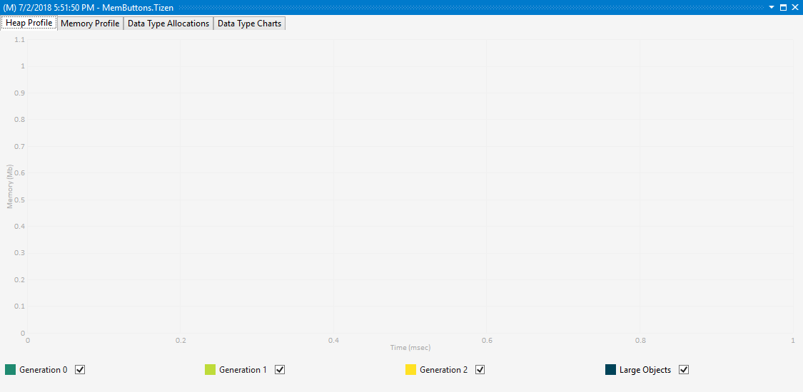

    The chart has 4 types of the optional curves:
    * Generation 0 - the youngest generation and contains short-lived objects. An example of a short-lived object is a temporary variable. Garbage collection occurs most frequently in this generation. 
    * Generation 1 - the generation contains short-lived objects and serves as a buffer between short-lived objects and long-lived objects.
    * Generation 2 - the generation contains long-lived objects. An example of a long-lived object is an object in a server application that contains static data that is live for the duration of the process.
    * Large Objects - contains very large objects that are 85,000 bytes and larger.

    [More info](https://docs.microsoft.com/dotnet/standard/garbage-collection/fundamentals)

  * **Memory Profile** - shows dynamic memory information during application's lifespan. **TODO**

    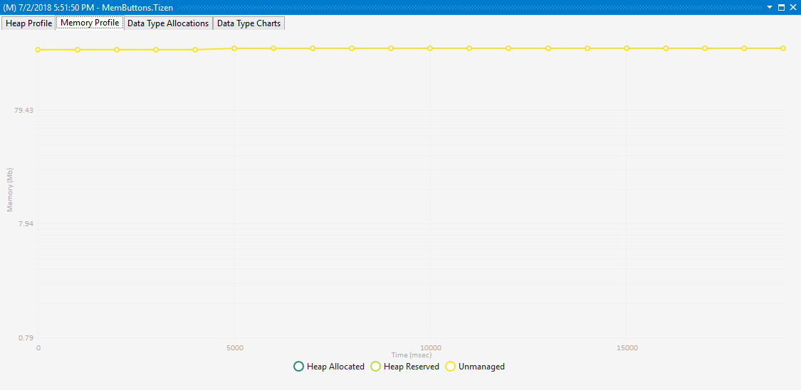

    The chart has 3 types of the curves:
    * Heap Allocated - allocated dynamic memory for objects.
    * Heap Reserved - reserved dynamic memory for allocations.
    * Unmanaged - total dynamic memory which application consumes.

  * **Data Type Allocations** - shows information about all allocations during application's lifespan.

    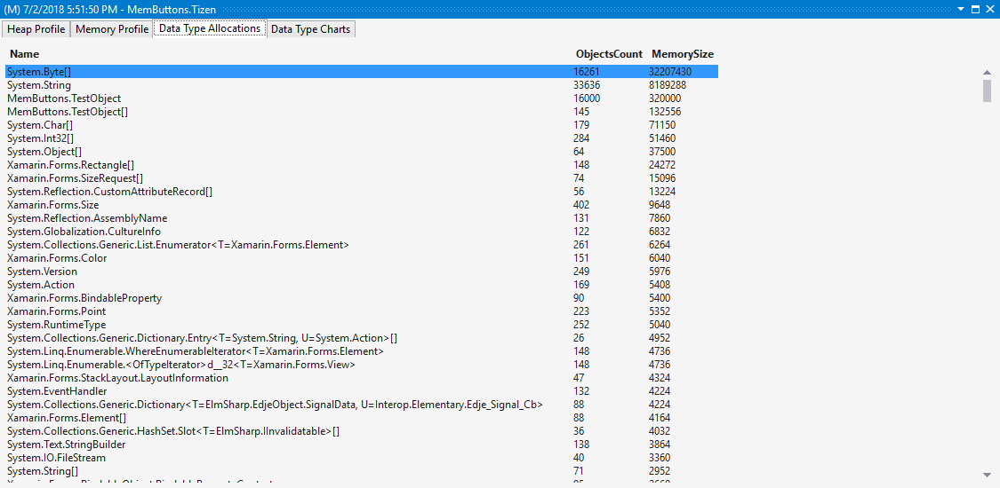

    There is list of all memory allocations. A list entry has the next fields:
    * Name - name of the data type.
    * Objects Count - number of the allocated objects.
    * Memory Size - total of allocated memory of the appropriate data type.

  * **Data Type Charts** - shows detailed information about all allocations during application's lifespan.

    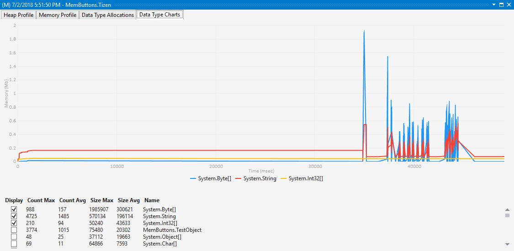

    The tab has two areas:
    * Chart - represents allocated memory by data type during application's lifespan.
    * List of the allocations - list of all allocations which can be represented in the chart. A list entry has the next fields:
      * Display - represent appropriate entry in the chart or not.
      * Count Max - max number of the allocated objects at once.
      * Count Avg - average number of the allocated objects.
      * Size Max - max size of the allocated memory at once.
      * Size Avg - average size of the allocated memory.
      * Name - name of the data type.
